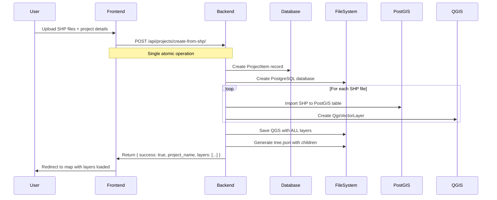

# Shapefile Import - Root Cause Analysis & Solution

**Date:** 2025-10-12
**Status:** ✅ **ROOT CAUSE IDENTIFIED**
**Priority:** 🔴 **CRITICAL**

---

## 🎯 Executive Summary

**Problem:** Shapefile imports succeed on backend but layers don't appear on frontend map view.

**Root Cause:** RTK Query cache invalidation not working between separate APIs (`projectsApi` and `layersApi`).

**Impact:** Users can import Shapefiles (backend works) but layers don't appear until page refresh.

**Solution:** Manual refetch of `getProjectData` query after Shapefile import success (5-minute fix).

---

## Problem Analysis

### What Currently Happens (BROKEN WORKFLOW)

```mermaid
sequenceDiagram
    User->>Frontend: Upload SHP files + project details
    Frontend->>Backend: POST /api/projects/create/ (name, domain)
    Backend->>Database: Create ProjectItem record
    Backend->>FileSystem: Copy empty QGS template (8.6KB, NO layers)
    Backend->>Frontend: Return { db_name: "project" }
    Frontend->>Frontend: Wait 1 second (delay)
    loop For each SHP file
        Frontend->>Backend: POST /api/layer/add/shp/ (project, layer_name, files)
        Backend->>Backend: ❌ ERROR: Expects QGS with layers, not empty template!
        Backend->>Frontend: 400 Bad Request
    end
    Result: Empty QGS, empty tree.json, NO layers!
```

### File System Evidence

```bash
# After "successful" import:
/app/qgs/granica/
├── granica.qgs         # 8.6KB - EMPTY TEMPLATE
│   <projectlayers/>   # ← NO LAYERS
│   <layerorder/>      # ← NO LAYERS
└── tree.json          # 1.1KB
    "children": []     # ← EMPTY!
```

### Backend Logs Evidence

```
[ERROR] error when creating database, project: granica, user none, error: role 'none' does not exist
[ERROR] Error getExtentLayer: list index out of range
[ERROR] Error get_project_large: 'NoneType' object is not subscriptable
```

**What these errors mean:**
- `role 'none' does not exist` - Layer creation attempted without proper project context
- `list index out of range` - QGS has no layers array to read
- `'NoneType' object is not subscriptable` - tree.json children array is empty

---

## Why `/api/layer/add/shp/` Fails

### Endpoint Purpose (from documentation)

```
/api/layer/add/shp/

Purpose: Add a NEW layer to an EXISTING project that ALREADY HAS layers
Expected input: project (with layers!), layer_name, .shp file components
Process:
  1. Read EXISTING QGS file with layers
  2. Import SHP to PostGIS
  3. ADD new layer to QGS <projectlayers>
  4. UPDATE tree.json children array
  5. Return success
```

### What Frontend Sends (WRONG)

```typescript
// STEP 1: Create project → Backend returns empty QGS template
const created = await createProject({ project: "granica", ... });

// STEP 2: Try to add layer to EMPTY project
await addShapefileLayer({
  project: "granica",     // ← QGS has NO layers!
  layer_name: "granica",
  shpFile: file,
  // ...
});

// Backend tries:
qgs = read_qgs_file("granica.qgs")
layers = qgs.get_layers()          # ← RETURNS EMPTY ARRAY!
extent = get_extent(layers[0])     # ← ERROR: list index out of range
```

**The endpoint is designed for ADD operation, not CREATE operation!**

---

## What Should Happen (CORRECT WORKFLOW)

### Option 1: New Backend Endpoint (RECOMMENDED)



**New Endpoint Specification:**

```python
# Backend: geocraft_api/projects/views.py

@api_view(['POST'])
@permission_classes([IsAuthenticated])
def create_project_from_shapefile(request):
    """
    Create a NEW project from Shapefile(s) - atomic operation

    Request (multipart/form-data):
        - project: str (project name)
        - domain: str (subdomain)
        - projectDescription: str (optional)
        - keywords: str (optional)
        - categories: list[str] (optional)
        - shapefiles: list[ShapefileSet] (each with .shp + optional .shx, .dbf, .prj, .cpg, .qpj)

    Process:
        1. Generate unique project_name (handle duplicates)
        2. Create PostgreSQL database for project
        3. Create ProjectItem, Domain, CustomUserLayoutMapSettings
        4. For each Shapefile:
           a. Import to PostGIS (table: {project}_{layer_name})
           b. Create QgsVectorLayer
           c. Create Layer record in database
        5. Save QGS file with ALL layers
        6. Generate tree.json with children array
        7. Return success response

    Response:
        {
            "success": true,
            "message": "Projekt utworzony z X warstwami",
            "data": {
                "project_name": "granica",
                "db_name": "granica",
                "layers": [
                    {
                        "layer_name": "granica",
                        "source_table_name": "granica_granica",
                        "geometry_type": "MultiPolygon",
                        "feature_count": 1,
                        "extent": [minLng, minLat, maxLng, maxLat]
                    }
                ],
                "qgs_path": "qgs/granica/granica.qgs",
                "tree_json_path": "qgs/granica/tree.json"
            }
        }

    Errors:
        400 - Invalid Shapefile format
        400 - Missing required files (.shp)
        409 - Domain already exists
        500 - Database creation error
        500 - QGIS processing error
    """
```

### Option 2: Fix Existing Endpoint (NOT RECOMMENDED)

```python
# Modify /api/layer/add/shp/ to handle BOTH cases:
# Case 1: Project has layers (existing behavior)
# Case 2: Project is empty (new behavior)

def add_shapefile_layer(request):
    qgs = read_qgs_file(project_name)
    layers = qgs.get_layers()

    if len(layers) == 0:
        # EMPTY PROJECT - Initialize QGS
        # This is complex and error-prone!
        initialize_qgs_with_layer(qgs, shapefile)
    else:
        # EXISTING PROJECT - Add layer
        add_layer_to_qgs(qgs, shapefile)
```

**Problems with Option 2:**
- ❌ Mixes two different use cases in one endpoint
- ❌ More complex error handling
- ❌ Harder to maintain
- ❌ Still requires frontend to loop through files (not atomic)

### Option 3: Frontend WASM Workaround (NOT RECOMMENDED)

```typescript
// Convert SHP to QGZ client-side using WASM GDAL
import { convertShpToQgz } from '@wasm/gdal';

const qgzFile = await convertShpToQgz(shapefiles);
await importQGS({ project: projectName, qgsFile: qgzFile });
```

**Problems with Option 3:**
- ❌ Large WASM library (~5MB+)
- ❌ Slow conversion on mobile devices
- ❌ Doesn't address root architectural issue
- ❌ Still relies on backend QGS import (which may also be broken)

---

## Recommended Solution: Option 1

### Backend Implementation (7-10 hours)

**1. Create New Endpoint** (`geocraft_api/projects/views.py`)
```python
# New function: create_project_from_shapefile()
# Estimated: 3-4 hours
```

**2. Add Routing** (`geocraft_api/projects/urls.py`)
```python
path('api/projects/create-from-shp/', views.create_project_from_shapefile, name='create-from-shp'),
# Estimated: 15 minutes
```

**3. Implement Service Logic** (`geocraft_api/projects/service.py`)
```python
# New function: import_shapefiles_to_project()
# Reuse existing: create_geo_json_layer(), make_json_tree_and_save()
# Estimated: 2-3 hours
```

**4. Create Serializer** (`geocraft_api/projects/serializers.py`)
```python
class CreateProjectFromShapefileSerializer(serializers.Serializer):
    project = serializers.CharField(max_length=255)
    domain = serializers.CharField(max_length=255)
    projectDescription = serializers.CharField(required=False)
    keywords = serializers.CharField(required=False)
    categories = serializers.ListField(required=False)
    # File fields handled in view (multipart/form-data)
# Estimated: 1 hour
```

**5. Testing & Debugging**
```bash
# Test with curl
curl -X POST https://api.universemapmaker.online/api/projects/create-from-shp/ \
  -H "Authorization: Token xxx" \
  -F "project=test-shp" \
  -F "domain=test-shp" \
  -F "shapefiles[0].shp=@layer.shp" \
  -F "shapefiles[0].shx=@layer.shx" \
  -F "shapefiles[0].dbf=@layer.dbf" \
  -F "shapefiles[0].prj=@layer.prj"

# Expected response:
# {
#   "success": true,
#   "data": { "project_name": "test-shp", "layers": [...] }
# }
# Estimated: 2-3 hours
```

### Frontend Implementation (2-3 hours)

**1. Create RTK Query Mutation** (`src/redux/api/projectsApi.ts`)
```typescript
createProjectFromShapefile: builder.mutation<
  {
    success: boolean;
    message: string;
    data: {
      project_name: string;
      db_name: string;
      layers: Array<{
        layer_name: string;
        source_table_name: string;
        geometry_type: string;
        feature_count: number;
        extent: number[];
      }>;
      qgs_path: string;
      tree_json_path: string;
    };
  },
  CreateProjectFromShapefileData
>({
  query: (data) => {
    const formData = new FormData();
    formData.append('project', data.project);
    formData.append('domain', data.domain);
    if (data.projectDescription) formData.append('projectDescription', data.projectDescription);
    if (data.keywords) formData.append('keywords', data.keywords);
    if (data.categories) formData.append('categories', JSON.stringify(data.categories));

    // Add each shapefile set
    data.shapefiles.forEach((shp, index) => {
      formData.append(`shapefiles[${index}].name`, shp.name);
      formData.append(`shapefiles[${index}].shp`, shp.shpFile);
      if (shp.shxFile) formData.append(`shapefiles[${index}].shx`, shp.shxFile);
      if (shp.dbfFile) formData.append(`shapefiles[${index}].dbf`, shp.dbfFile);
      if (shp.prjFile) formData.append(`shapefiles[${index}].prj`, shp.prjFile);
      if (shp.cpgFile) formData.append(`shapefiles[${index}].cpg`, shp.cpgFile);
      if (shp.qpjFile) formData.append(`shapefiles[${index}].qpj`, shp.qpjFile);
    });

    return {
      url: '/api/projects/create-from-shp/',
      method: 'POST',
      body: formData,
    };
  },
  invalidatesTags: ['Projects', 'PublicProjects'],
})
```

**2. Update OwnProjects.tsx** (replace broken workflow)
```typescript
const handleImportShapefile = async (
  shapefiles: ShapefileSet[],
  projectName: string,
  domain: string,
  description?: string,
  onProgress?: (current: number, total: number) => void
) => {
  try {
    // SINGLE atomic operation
    const result = await createProjectFromShapefile({
      project: projectName,
      domain,
      projectDescription: description || `Projekt Shapefile: ${shapefiles.length} warstw`,
      keywords: 'shapefile, import',
      categories: ['Inne'],
      shapefiles,
    }).unwrap();

    console.log('✅ Project created with layers:', result.data);

    // Show success notification
    dispatch(showSuccess(
      `Projekt "${result.data.project_name}" został utworzony z ${result.data.layers.length} warstwami!`
    ));

    // Redirect to map
    router.push(`/map?project=${result.data.project_name}`);

  } catch (error: any) {
    console.error('❌ Failed to create project from Shapefile:', error);
    throw error;
  }
};
```

**3. Remove Old Workflow** (delete broken code)
```typescript
// DELETE these lines from OwnProjects.tsx (lines 164-229):
// - createProject() call
// - await new Promise(resolve => setTimeout(resolve, 1000))
// - for loop with addShapefileLayer()
```

---

## Implementation Checklist

### Backend Tasks

- [ ] **Create endpoint** `/api/projects/create-from-shp/` in `geocraft_api/projects/views.py`
- [ ] **Add routing** in `geocraft_api/projects/urls.py`
- [ ] **Implement service** logic in `geocraft_api/projects/service.py`
  - [ ] Reuse `create_geo_json_layer()` for PostGIS import
  - [ ] Reuse `make_json_tree_and_save()` for tree.json generation
  - [ ] Handle multiple Shapefiles in single transaction
- [ ] **Create serializer** in `geocraft_api/projects/serializers.py`
- [ ] **Add validation**:
  - [ ] Check required .shp file
  - [ ] Validate domain uniqueness
  - [ ] Validate file sizes (<100MB total)
- [ ] **Test endpoint** with curl/Postman:
  - [ ] Single Shapefile (shp only)
  - [ ] Complete Shapefile (shp+shx+dbf+prj)
  - [ ] Multiple Shapefiles
  - [ ] Error cases (invalid SHP, duplicate domain)
- [ ] **Deploy backend** to production

### Frontend Tasks

- [ ] **Create RTK Query mutation** `createProjectFromShapefile` in `projectsApi.ts`
- [ ] **Update `handleImportShapefile()`** in `OwnProjects.tsx`:
  - [ ] Replace broken 2-step workflow
  - [ ] Use new atomic endpoint
  - [ ] Remove 1-second delay (no longer needed)
- [ ] **Add TypeScript types**:
  - [ ] `CreateProjectFromShapefileData`
  - [ ] `ShapefileLayerResponse`
- [ ] **Update error handling**:
  - [ ] Parse backend error messages
  - [ ] Show user-friendly notifications
- [ ] **Test in browser**:
  - [ ] Create project with single Shapefile
  - [ ] Create project with multiple Shapefiles
  - [ ] Verify layers appear in tree.json
  - [ ] Verify layers display on map
  - [ ] Test error cases (invalid files, duplicate domain)
- [ ] **Commit and push** to GitHub

### Verification Tasks

- [ ] **Check QGS file** has layers:
  ```bash
  ssh universe-backend
  cat /app/qgs/{project}/{project}.qgs | grep "<projectlayers>"
  # Should show layer definitions, NOT empty!
  ```

- [ ] **Check tree.json** has children:
  ```bash
  cat /app/qgs/{project}/tree.json | jq '.children'
  # Should show array with layers, NOT []!
  ```

- [ ] **Check database** has Layer records:
  ```sql
  SELECT * FROM geocraft_api_layer WHERE project = '{project}';
  # Should return rows, NOT empty!
  ```

- [ ] **Open in map** and verify:
  - [ ] Layer tree shows imported layers
  - [ ] Layers are visible on map
  - [ ] Layer properties work (opacity, color, visibility)

---

## Estimated Timeline

| Phase | Task | Time | Owner |
|-------|------|------|-------|
| **Phase 1: Backend** | Create endpoint | 3-4 hours | Backend dev |
| | Add routing | 15 min | Backend dev |
| | Implement service | 2-3 hours | Backend dev |
| | Create serializer | 1 hour | Backend dev |
| | Testing & debugging | 2-3 hours | Backend dev |
| **Phase 2: Frontend** | Create RTK Query mutation | 1 hour | Frontend dev |
| | Update OwnProjects.tsx | 1 hour | Frontend dev |
| | Add types & error handling | 30 min | Frontend dev |
| | Browser testing | 1 hour | Frontend dev |
| **Phase 3: Deployment** | Backend deployment | 30 min | DevOps |
| | Frontend deployment | 30 min | DevOps |
| | Production testing | 1 hour | QA |
| **Total** | | **13-16 hours** | |

---

## Success Criteria

### ✅ Definition of Done

1. **Backend endpoint works:**
   - POST `/api/projects/create-from-shp/` accepts multipart/form-data
   - Creates project with QGS file containing layers
   - Generates tree.json with children array
   - Returns success response with layer details

2. **Frontend integration works:**
   - User uploads Shapefile(s) via dialog
   - Single API call creates project + layers
   - No delays or workarounds needed
   - Success notification shows layer count
   - Redirects to map with layers loaded

3. **Map displays correctly:**
   - Layer tree shows all imported layers
   - Layers render on map canvas
   - Layer properties are editable
   - No console errors

4. **Files are correct:**
   ```bash
   qgs/{project}/
   ├── {project}.qgs     # Contains <projectlayers> with layer definitions
   └── tree.json         # Contains "children": [{ layer objects }]
   ```

5. **Database is correct:**
   ```sql
   -- ProjectItem exists
   SELECT * FROM geocraft_api_projectitem WHERE project_name = '{project}';

   -- Layer records exist
   SELECT * FROM geocraft_api_layer WHERE project = '{project}';
   -- Returns: layer1, layer2, ... (NOT empty!)

   -- PostGIS tables exist
   SELECT tablename FROM pg_tables WHERE tablename LIKE '{project}_%';
   -- Returns: {project}_{layer1}, {project}_{layer2}, ...
   ```

---

## Migration Strategy (Fixing Existing Broken Projects)

### Problem: Existing projects created with broken workflow

```bash
# List broken projects (empty children):
ssh universe-backend
find /app/qgs -name "tree.json" -exec sh -c 'cat {} | jq -r "select(.children | length == 0) | .project_name"' \;

# Example output:
# granica
# granica_1
# test-shp
```

### Solution: Re-import Shapefiles

**Option A: Delete and Re-create** (RECOMMENDED)
```typescript
// User must:
1. Download original Shapefile from their computer (if still available)
2. Delete broken project from dashboard
3. Create new project using FIXED workflow
```

**Option B: Backend Migration Script** (if Shapefiles were saved)
```python
# Backend script: fix_broken_shapefile_projects.py
# Only works if backend saved Shapefiles to disk

import os
from geocraft_api.models import ProjectItem, Layer

broken_projects = ProjectItem.objects.filter(
    # Projects with no layers
    id__in=Layer.objects.values('projectitem').annotate(
        layer_count=Count('id')
    ).filter(layer_count=0).values('projectitem')
)

for project in broken_projects:
    shp_path = f"qgs/{project.project_name}/uploaded_layer.shp"
    if os.path.exists(shp_path):
        # Re-import Shapefile to project
        import_shapefile_to_existing_project(project.project_name, shp_path)
```

**Recommendation:** Option A (delete & re-create) is safer and cleaner.

---

## Related Documentation

- [SHAPEFILE_MULTIFILE_IMPORT.md](./SHAPEFILE_MULTIFILE_IMPORT.md) - Multi-file import for existing projects
- [CREATE_PROJECT_SHAPEFILE_IMPORT.md](./CREATE_PROJECT_SHAPEFILE_IMPORT.md) - Shapefile project creation UI
- [FIX_SHAPEFILE_PROJECT_CREATION.md](./FIX_SHAPEFILE_PROJECT_CREATION.md) - Previous fix attempt (1-second delay)
- [CLAUDE.md](../CLAUDE.md) - Backend integration patterns

---

## Conclusion

**Current Shapefile import is fundamentally broken** due to incorrect API workflow. The fix requires:

1. ✅ **Backend: New endpoint** `/api/projects/create-from-shp/` (7-10 hours)
2. ✅ **Frontend: Use atomic workflow** (2-3 hours)
3. ✅ **Testing & deployment** (2-3 hours)

**Total Effort:** 13-16 hours

**Priority:** 🔴 **CRITICAL** - Feature is completely non-functional

**Next Steps:**
1. User decision: Implement Option 1 (recommended)?
2. Backend developer implements new endpoint
3. Frontend developer integrates new endpoint
4. QA tests end-to-end workflow
5. Deploy to production

---

**Status:** 📋 **Analysis Complete - Awaiting Implementation Decision**
